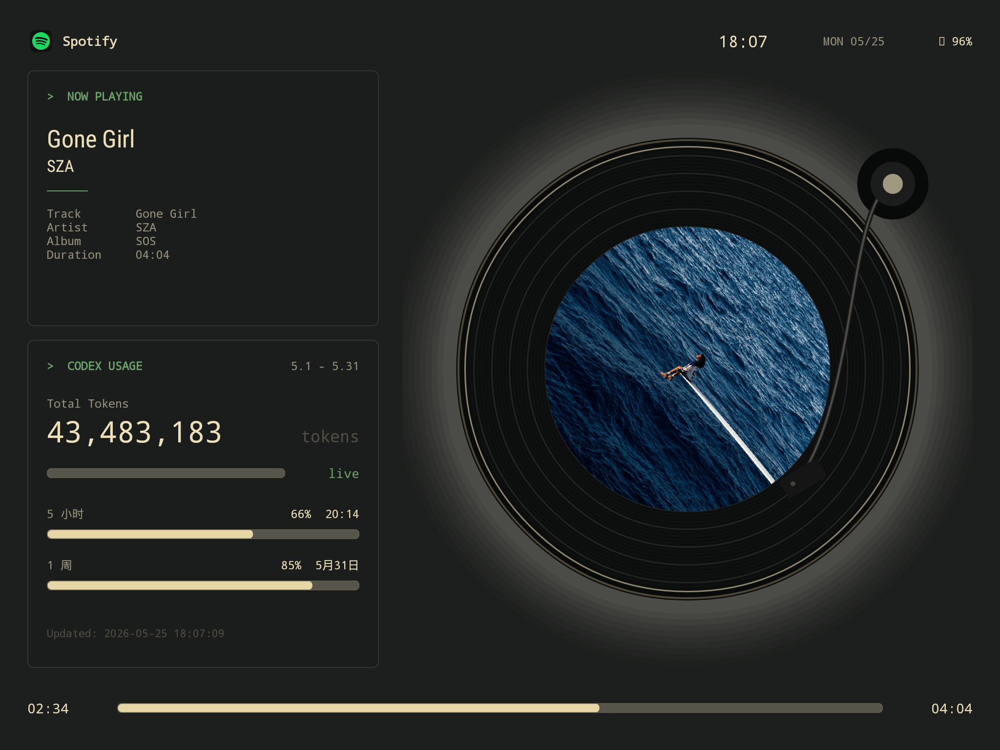

# Codex Android 侧屏

一个原生 Android 侧屏应用，重点是把老旧或闲置的 Android 平板改造成常驻 sidecar 展示屏，用来显示 Spotify 当前播放、专辑封面和 Codex 真实用量。项目包含 Android app、本地 Python sidecar，以及可给 OpenClaw、Hermes、Codex 等大模型直接复现部署的 skill 包。



## 功能

- 让闲置 Android 平板重新变成桌面信息屏，而不是继续吃灰。
- Spotify 图标、歌曲、歌手、专辑、播放进度与专辑封面展示。
- Codex 真实账户用量展示，包含 `5 小时` 与 `1 周` 剩余量和重置时间。
- 横屏与竖屏自适应布局。
- 支持 USB `adb reverse` 和局域网访问两种连接方式。
- 不依赖 Gradle，使用 Android SDK 命令行工具构建 APK。

## 目录

- `src/com/example/helloworld/MainActivity.java`：Android 原生界面和数据轮询逻辑。
- `status_server.py`：本地 sidecar，提供 `/status`、`/spotify-art` 和播放控制接口。
- `build.sh`：构建并签名 debug APK。
- `start_sidecar.sh` / `stop_sidecar.sh`：启动或停止本地 sidecar。
- `dist/skills/codex-side-display/`：可交给大模型代理使用的完整 skill 包。
- `docs/DEPLOYMENT.md`：部署与排障文档。

## 快速开始

准备依赖：

- macOS、Python 3、ADB。
- Android SDK build-tools 与 platform。
- JDK 17。
- Codex Desktop 或 Codex CLI，默认读取 `/Applications/Codex.app/Contents/Resources/codex`。
- Spotify 可选；没有 Spotify 时仍会展示 Codex 数据。

构建 APK：

```bash
./build.sh
```

启动 sidecar：

```bash
./start_sidecar.sh
```

安装到指定 Android 设备：

```bash
adb devices -l
adb -s <设备序列号> install -r build/HelloWorld.apk
adb -s <设备序列号> shell am start -W -n com.example.helloworld/.MainActivity
```

更多一键部署、局域网配置和常见问题见 [部署文档](docs/DEPLOYMENT.md)。

## Skill 部署

`dist/skills/codex-side-display/` 是给 OpenClaw、Hermes、Codex 等代理使用的完整 skill。进入 skill 目录后可以运行：

```bash
python3 scripts/deploy_side_display.py --target ./workspace --device <设备序列号> --force
```

脚本会复制模板、写入当前主机 IP、启动 sidecar、构建 APK、安装并打开应用。

## 安全说明

仓库不需要提交任何 API key、访问令牌或私钥。`debug.keystore`、构建产物、日志、PID 文件、本地截图和个人技术记录都已加入 `.gitignore`。

`status_server.py` 会在本机运行时读取本地 Codex 状态库和 Codex app-server 的账户限额接口，这些数据只在本机 sidecar 运行时动态读取，不会写入仓库。
